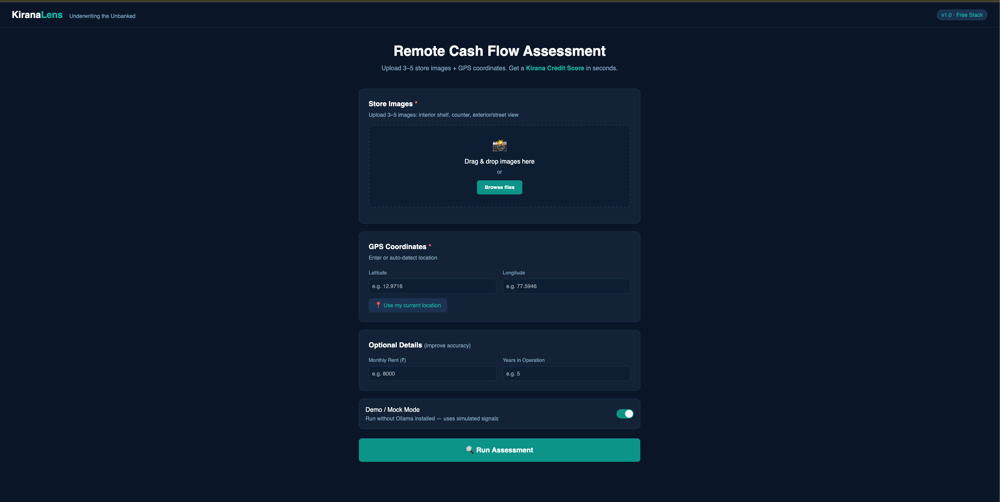
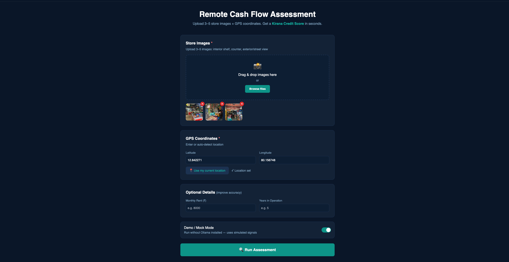
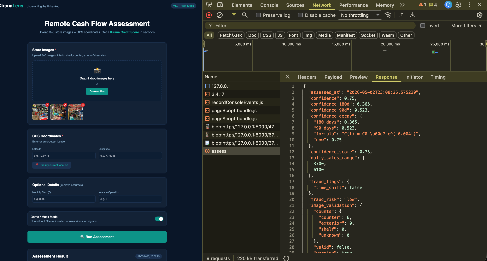

# 🏪 KiranaLens: Underwriting the Unbanked

[](https://github.com/gantayat03/kiranalens/actions)
[](https://www.python.org)
[](LICENSE)
[](#tech-stack)

> **Remote cash flow underwriting for India's 13 million kirana stores, using Vision AI, Geo Intelligence, and fraud-resilient signals. No transaction data. No GST records. No manual surveys.**

Built for the **TenzorX 2026 National AI Hackathon** Poonawalla Fincorp problem statement.

---

## 🎯 What It Does

Upload 3–5 photos of any kirana store + GPS coordinates.
Get back a **Kirana Credit Score (KCS 0–850)** + revenue ranges + fraud flags, in under 60 seconds.

```json
{
  "kcs_score": 672,
  "confidence": 0.78,
  "revenue_estimate": {
    "daily": [7500, 11000],
    "monthly": [195000, 286000]
  },
  "loan": {
    "eligible_loan": 200000,
    "emi": 9988,
    "tenure": 24,
    "interest_rate": 18,
    "net_disposable_income": 280000
  },
  "fraud_flags": {
    "time_shift": false,
    "active": []
  },
  "image_validation": {
    "valid": true,
    "warning": false,
    "warnings": []
  }
}
```

---

## Quick Start

### Option A: Mock Mode (works instantly, no Ollama needed)

```bash
git clone https://github.com/gantayat03/kiranalens.git
cd kiranalens
pip install -r requirements.txt
python app.py
```

Open **http://localhost:5000** → enable **Demo/Mock Mode** toggle → upload any images → Run Assessment.

### Option B: Real Vision AI (requires Ollama)

```bash
# Install Ollama: https://ollama.com/download
ollama pull llava:13b        # one-time ~8 GB download
pip install -r requirements.txt
python app.py
```

### Option C: Docker

```bash
docker build -t kiranalens .
docker run -p 5000:5000 kiranalens
```

---

## Project Structure

```
kiranalens/
├── app.py              ← Flask server & routes
├── worker.py           ← Lightweight async queue worker
├── vision.py           ← LLaVA image analysis (Ollama, local)
├── geo.py              ← OSM Overpass geo signals (free, no key)
├── fraud.py            ← Shadow-clock + cross-checks
├── scoring.py          ← Fusion engine + KCS score
├── config/
│   ├── calibration.json ← Placeholder constants (not calibrated on real data)
│   └── seasonality.json ← Month-wise revenue multipliers
├── requirements.txt
├── Dockerfile
├── templates/
│   └── index.html      ← Upload UI + result dashboard
├── tests/
│   ├── test_pipeline.py
│   └── smoke_test.py
└── .github/workflows/ci.yml
```

---

## Architecture

```
INPUT: 3-5 images  +  GPS  +  EXIF metadata
         ↓  Pre-processing (OpenCV · Pillow)
         ↓
VISION AI -  Ollama + LLaVA (local, free)
  Shelf Density · SKU Diversity · Inventory Value · Refill Velocity
         ↓
GEO INTEL -  OSM Overpass API (free, no key)
  Catchment · Footfall · ATM/Wage Proxy · Competition
         ↓
FRAUD DETECTION
  Shadow-Clock · Inventory-Geo Cross-Check · Camera Angle · Refill Timing
         ↓
FUSION ENGINE -  Weighted scoring + seasonality-aware revenue
         ↓
OUTPUT: KCS Score · Revenue Ranges · Loan Structure · Fraud Flags
```

---

## 📸 Demo Screenshots

### 🔹 Upload Interface


### 🔹 Store View


### 🔹 Assessment Output (KCS + Loan)


### 🔹 Backend Decision Output (API Response)


---

## Key Innovations

| Feature | Description |
|---------|-------------|
| **Shadow-Clock Fraud** | `suncalc` computes expected shadow angle from GPS + EXIF time. Mismatch = photo taken another day. |
| **Refill Velocity Score** | Partial shelves at noon = high throughput. Overfull at noon = staged inventory. |
| **ATM Wage Proxy** | OSM ATM + auto-stand density within 500m → local disposable income signal. No paid API. |
| **Confidence Decay** | `C(t) = C₀ × e^(-0.004t)` auto-reduces score confidence over time- prevents stale disbursal. |
| **KCS Score (0–850)** | CIBIL-style branded composite score for physical kirana stores. |

---

## Tech Stack 

| Component | Tool |
|-----------|------|
| Vision AI | Ollama + LLaVA 1.6 (local) |
| Geo data | OpenStreetMap Overpass API |
| Shadow geometry | `suncalc` (MIT, pure Python) |
| Backend | Python 3.11 + Flask |
| Frontend | HTML + Tailwind CSS (CDN) |
| Image processing | Pillow |
| CI | GitHub Actions |

---

## API

### `POST /assess`

| Field | Required | Description |
|-------|----------|-------------|
| `images[]` | Yes | 1–5 store images |
| `lat`, `lng` | Yes | GPS coordinates |
| `rent` | No | Monthly rent ₹ |
| `shop_age` | No | Years operating |
| `mock` | No | `"1"` for demo mode |

Returns a complete underwriting response object. If real-model execution is unavailable, request is queued and response is `202` with a `job_id`.

### `POST /upload`

Async-first upload endpoint. Stores files, queues a job, and returns:

```json
{ "queued": true, "job_id": "<uuid>", "session_id": "<id>" }
```

### `GET /status/<job_id>`

Check queued job state: `queued` → `processing` → `completed`/`failed`.

---

## Running Tests

```bash
pytest tests/ -v
python tests/smoke_test.py
```

---

## License

MIT TenzorX 2026 National AI Hackathon
